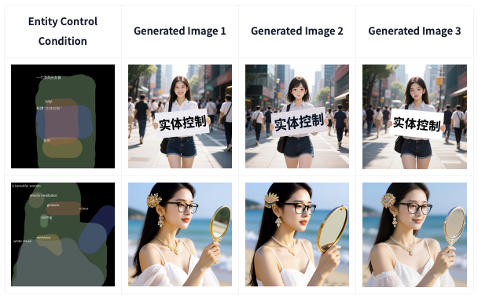

# A collection of Awesome workflows for creative design

## ComfyUI

### Nano-Banana tricks
- [PicoTrex](https://github.com/PicoTrex/Awesome-Nano-Banana-images?tab=readme-ov-file)

- https://github.com/ZHO-ZHO-ZHO/ComfyUI-Workflows-ZHO

### Qwen Image
- Qwen Image Eligen [[HF](https://huggingface.co/DiffSynth-Studio/Qwen-Image-EliGen-V2) | [ComfyUI](https://github.com/AIFSH/QwenImage-Diffsynth/tree/main?tab=readme-ov-file)]

### Bytedance

## Papers
- DreamOmni2: Multimodal Instruction-based Editing and Generation, [Code](https://github.com/dvlab-research/DreamOmni2), [Project](https://pbihao.github.io/projects/DreamOmni2/index.html)

